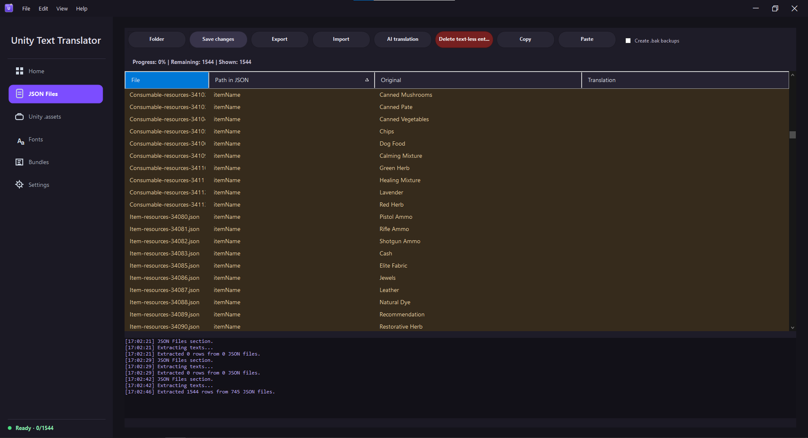
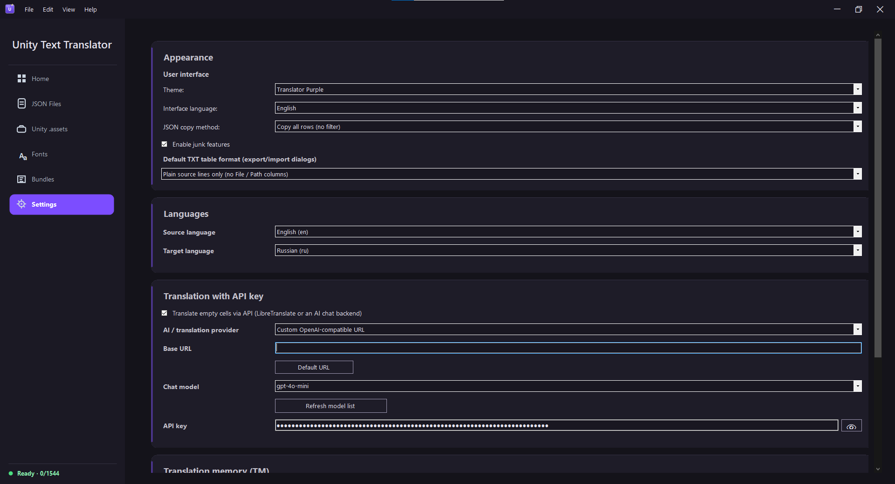

**English** | [Русский](README.ru.md)

# Unity Text Translator

A program for translating Unity games.

## What it does

- Unity .assets module: export objects from `.assets` to JSON and build them back into a new `.assets` after you edit the JSON.
- Localize `.bundle` files.
- Replace a font inside an asset with a Cyrillic one (for IL2CPP games).
- Pull strings out of JSON: recursively finds text fields in the Unity JSON tree and puts them in a table.
- Translation memory (TM): reuses matches you already translated.
- Automatic translation via an API key. It fills empty strings and skips anything that looks like code. Backends: LibreTranslate, OpenRouter, local OpenAI-compatible servers (e.g. LM Studio).
- Paste an AI reply from the clipboard, search the table, themes, autosave.

There are still some bugs; they're being fixed.

## How to use

1. **Get the game text as JSON.** If you already have JSON dumps, skip this. Otherwise use the **Unity .assets** or **Bundles** tab to export the game's `.assets`/`.bundle` into a JSON folder.
2. **Open the folder.** On the **JSON Files** tab click **Folder** and pick that JSON folder. The table fills with rows: File / Path / Original / Translation.
3. **Translate.** Type into the **Translation** column, or:
   - **AI translation** — fill empty cells through the API set in Settings (LibreTranslate / OpenRouter / a local OpenAI-compatible server);
   - **Copy / Paste** — copy the rows as a table, paste them into any chat model, then paste the reply back (it's matched by content, so row order doesn't matter);
   - Translation Memory auto-fills matches you already translated.
4. **Save changes** — writes the translations back into the JSON files (keep **Create .bak backups** on for safety).
5. **Put it back into the game.** Use the **Unity .assets** / **Bundles** tab to pack the translated JSON back into `.assets`/`.bundle`.
6. **Cyrillic not showing? (IL2CPP / TextMeshPro)** Open the **Fonts** tab and run the wizard: analyze the `.assets` → build the atlas → patch → apply.

Set the source/target language, theme and API key on the **Settings** tab.

## Building

Open `UnityTextTranslator.slnx` in Visual Studio and build Release. Dependencies are packed into a single `.exe` with Fody/Costura. The project targets .NET Framework 4.8 and restores its NuGet packages automatically.

Run the unit tests with `dotnet test` — the `UnityTextTranslator.Tests` project targets net8.0 and needs no Visual Studio.

## Third-party

- [AssetsTools.NET](https://github.com/nesrak1/AssetsTools.NET) and [AddressablesTools](https://github.com/nesrak1/AddressablesTools) (nesrak1, MIT) — reading and writing Unity files, via NuGet.
- The JSON layout is compatible with [UABEA / UABEAvalonia](https://github.com/nesrak1/UABEA) (nesrak1, MIT); its `classdata.tpk` is downloaded at runtime. No UABEA code is included here.
- [Mono.Cecil](https://github.com/jbevain/cecil), [Newtonsoft.Json](https://www.newtonsoft.com/json), [Fody/Costura](https://github.com/Fody/Costura) — via NuGet.
- [msdf-atlas-gen](https://github.com/Chlumsky/msdf-atlas-gen) (Viktor Chlumský, MIT) — generates the SDF atlas for the font replacement.

## License

[MIT](LICENSE) © 2026 redonkym.
